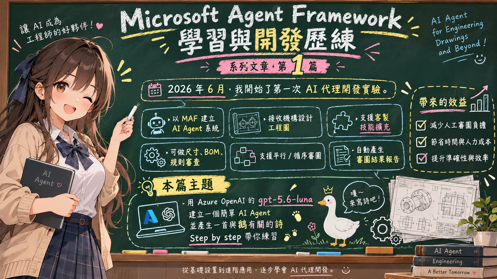

# MFA001 Microsoft Agent Framework 初次體驗開發出 AI 代理

在 2026 年初，我看到了 Microsoft 推出了全新的 Microsoft Agent Framework，這是一個用於在 .NET 環境中建構 AI 代理的強大工具。面對 2026 年的 AI 元年，看到各種 AI Agent 的應用在市面上氾濫出現，讓我也想要能夠讓自己可以有能力來自行開發出適合自己使用的 AI Agent 代理應用系統。



在 2026 年六月，我透過了 MAF Microsoft Agent Framework，開始了我的第一次 AI 代理開發實驗。這是一個可以接收到來自使用者上傳過來的機構設計工程圖，我設計了不同的 AI Agent，並且外掛了可以讓使用者自行客製技能的功能，讓整個系統更加靈活且可擴展，並且可以針對接收到的功能圖，進行各種不同審圖需求的處理。在沒有這樣系統出現之前，這些工作大多需要人工處理，需要由資深且經驗的設計師，逐一針對所接收到工程圖，針對尺寸、BOM、檢視、公司或者客戶特殊需求，進行詳細的審查與確認，而且，這樣的工作，並不是僅透過一個人就可以完成，需要多人協作，既耗時又容易出錯，而透過 AI 代理的協助，整個流程變得更加高效且可靠。我使用 MAF 框架來建立這個系統，並且成功地實現了自動化審圖的功能。可以選擇平行或者循序的方式來進行審圖，最後，將會產生出這個工程圖的審圖結果報告，大幅節省了時間與人力成本，並且提升了整個設計流程的準確性與效率。

有鑑於此，我決定撰寫出系列文章，分享我在使用 Microsoft Agent Framework 開發 AI 代理的過程與心得。每篇文章將會聚焦於不同的開發主題，從基礎設置到進階應用，逐步帶領讀者了解如何利用這個框架建立功能強大的 AI 代理。並且程式碼設計的儘可能簡單與清爽，讓讀者可以不會很費力地來理解整個開發流程。

這篇文章將會是 Microsoft Agent Framework 學習與開發歷練系列文章的第一篇，在這裡我選擇的主題為：如何用 Azure OpenAI 的 gpt-5.6-luna 聊天模型建立一個簡單 AI 代理，並產生一篇與鵝有關的詩。若想要知道如何透過 Microsoft Agent Framework 建立 AI 代理，可以跟著這篇文章說明， step by step 逐一練習，便可以做出與學會使用 AI 代理的技術。

# 建立 Console 專案
* 開啟 Visual Studio 2026
* 選擇「建立新專案」
* 在 [建立新的專案] 視窗中，在右方清單內，找到並選擇「主控台應用程式」 項目
* 然後點擊右下方「下一步」按鈕
* 此時將會看到 [設定新的專案] 對話窗
* 在該對話窗的 [專案名稱] 欄位中，輸入專案名稱，例如 "csFirstAgent"
* 然後點擊右下方「下一步」按鈕
* 接著會看到 [其他資訊] 對話窗
* 在這個對話窗內，確認使用底下的選項
    * 架構：.NET 10.0 (或更新版本)
    * 勾選 不要使用最上層陳述式 (這是我的個人習慣)
* 然後點擊右下方「建立」按鈕
* 現在，已經完成了這個 Console 主控台 專案的建立

## 安裝需要用到的 NuGet 套件

要完成這個第一次接觸 Microsoft Agent Framework 練習專案，需要安裝以下幾個 NuGet 套件：

### Microsoft.Extensions.AI

這個套件將會為生成式 AI 定義的一層「統一抽象介面 + Middleware 管線」，讓開發者可以更方便地整合不同的生成式 AI 模型，並且在應用程式中使用一致的方式進行呼叫與管理。

* 滑鼠右擊 [csFirstAgent] 專案節點
* 點選彈出功能表的 [管理 NuGet 套件] 項
* 在 [瀏覽] 索引標籤中，搜尋並且安裝底下的 NuGet 套件
    * Microsoft.Extensions.AI
    
### Microsoft.Extensions.AI.OpenAI

這個套件是微軟官方為 .NET 整合 AI 服務所提供的擴充套件。它實現了 IChatClient 與 IEmbeddingGenerator 核心抽象介面，讓開發人員能以一致的程式碼，輕鬆串接 OpenAI 或相容的 API 端點（例如 Azure OpenAI、GitHub Models 等）。

* 滑鼠右擊 [csFirstAgent] 專案節點
* 點選彈出功能表的 [管理 NuGet 套件] 項
* 在 [瀏覽] 索引標籤中，搜尋並且安裝底下的 NuGet 套件
    * Microsoft.Extensions.AI.OpenAI
    
### Microsoft.Agents.AI

這個套件是微軟官方推出 Microsoft Agent Framework（微軟智慧代理框架）的核心 .NET 套件。它主要用於在 .NET 環境中建構、協調與部署 AI 代理（AI Agents） 及多代理工作流（Multi-agent workflows），是用來取代舊版 AutoGen 的企業級解決方案。

* 滑鼠右擊 [csFirstAgent] 專案節點
* 點選彈出功能表的 [管理 NuGet 套件] 項
* 在 [瀏覽] 索引標籤中，搜尋並且安裝底下的 NuGet 套件
    * Microsoft.Agents.AI
     
### OpenAI

這個套件為官方的 OpenAI .NET 客戶端類別庫，是 OpenAI NuGet 套件。此套件由 OpenAI 與 Microsoft 合作開發，提供直接存取 OpenAI 官方 REST API 的便利管道。

* 滑鼠右擊 [csFirstAgent] 專案節點
* 點選彈出功能表的 [管理 NuGet 套件] 項
* 在 [瀏覽] 索引標籤中，搜尋並且安裝底下的 NuGet 套件
    * OpenAI

# 宣告 API 端點與 Key 環境變數

若把 AI 用到的 Key 與服務端點曝露在程式碼內，這個程式碼又簽入到版本控制系統（例如 GitHub），將會造成安全風險，因此建議使用環境變數來管理這些敏感資訊。

## Windows 建立環境變數

* 如果是在 Windows 開發環境，可以從「系統環境變數」進行設定。首先，在 Windows 搜尋列輸入「環境變數」，接著開啟：編輯系統環境變數
* 在「系統內容」視窗中選擇：進階→ 環境變數
* 接下來可以選擇建立「使用者變數」或「系統變數」。我個人都是建立 系統變數 的方式。
* 新增第一個變數：
  * 變數名稱：AzureOpenAI_Key
  * 變數值：你的 Azure OpenAI API Key
* 接著再新增第二個變數：
  * 變數名稱：AzureOpenAI_Endpoint
  * 變數值：https://你的資源名稱.openai.azure.com/
* 完成後按下「確定」儲存。

## 使用 PowerShell 建立環境變數

如果習慣使用 PowerShell，也可以直接透過指令建立。例如建立目前 Windows 使用者層級的環境變數：

```powershell
[Environment]::SetEnvironmentVariable(
    "AzureOpenAI_Key",
    "你的 Azure OpenAI API Key",
    "Machine"
)

[Environment]::SetEnvironmentVariable(
    "AzureOpenAI_Endpoint",
    "https://你的資源名稱.openai.azure.com/",
    "Machine"
)
```

設定完成後，通常需要重新開啟 Visual Studio、VS Code、Terminal 或 PowerShell，新的 Process 才會取得最新的環境變數。

# 修改 Program.cs 程式碼

為了要完成這個需求 : 如何用 Azure OpenAI 的 gpt-5.6-luna 聊天模型建立一個簡單 AI 代理，並產生一篇與鵝有關的詩。
因此，我們需要修改 Program.cs 程式碼，這時需要完成底下的操作。

* 在專案內，找到並且開啟 [Program.cs] 檔案
* 使用底下程式碼內容來取代 [Program.cs] 檔案的內容

```csharp
using Microsoft.Agents.AI;
using Microsoft.Extensions.AI;
using OpenAI;
using OpenAI.Chat;
using System.ClientModel;

namespace csFirstAgent;

internal class Program
{
    static async Task Main(string[] args)
    {
        var apiKey = Environment.GetEnvironmentVariable("AzureOpenAI_Key");
        var endpoint = Environment.GetEnvironmentVariable("AzureOpenAI_Endpoint");
        var model = "gpt-5.6-luna";

        IChatClient chatClient =
            new ChatClient(
                    model,
                    new ApiKeyCredential(apiKey!),
                    new OpenAIClientOptions { Endpoint = new Uri(endpoint) })
                .AsIChatClient();

        AIAgent agent = new ChatClientAgent(
            chatClient, // 聊天用戶端
            "詩人", // 代理名稱
            "創作引人入勝、富有創意的詩。.", // 系統提示詞
            null); // 其他設定

        Console.WriteLine($"{DateTime.Now} 開始呼叫 LLM API / 使用的模型: {model}");
        var response = await agent.RunAsync("寫一個關於鵝的詩。");

        Console.WriteLine(response.Text);
        Console.WriteLine($"{DateTime.Now} 完成呼叫 LLM API / 使用的模型: {model}");
    }
}
```

在上述的程式碼中，可以看出當想要使用 Microsoft Agent Framework 套件，第一次進行開發出 AI Agent 應用的最簡單的開發作法，在這些程式碼可以看到共有幾個區塊：1. 初始化聊天用戶端 (IChatClient) 2. 建立 AI 代理 (AIAgent) 3. 呼叫代理並取得回應 4. 輸出結果

因此，開發者只需要依照這個範例程式碼的結構，就能快速建立一個簡單的 AI 代理，並透過 Azure OpenAI 的 gpt-5.6-luna 聊天模型來生成內容。

## 1. 初始化聊天用戶端

* 在這個應用範例中，將會用到 Chat Completion 的 API 呼叫模式，因此，在這裡將會需要建立聊天用戶端 (IChatClient)，這裡將會透過new ChatClient(...) 來建立。
* 在建立 ChatClient 執行個體物件時候，將會在建構式中傳入模型名稱、API Key 以及 Endpoint 等必要資訊。
* 由於 API Key 是敏感資訊，因此在程式碼中不會直接寫死，而是透過環境變數來取得。
* 在底下程式碼之前，將會透過 `var apiKey = Environment.GetEnvironmentVariable("AzureOpenAI_Key");` & `var endpoint = Environment.GetEnvironmentVariable("AzureOpenAI_Endpoint");` 來取得必要的環境變數。這些環境變數必須要參考前面說明內容，使用 GUI 介面或者 PowerShell 命令，將環境變數與設定值綁定在一起。
  > 注意：在實際開發中，請確保環境變數已正確設定，否則程式將無法成功取得 API Key 與 Endpoint。
* 而模型名稱，則是使用 `var model = "gpt-5.6-luna";` 程式碼，直接寫在程式碼中
  > 這裡選擇的模型是最輕巧、快速回應的模型，僅是作為教學說明目的而採用，你可以根據你本身的需求來設定使用更為強大的模型，
* 最後，透過 AsIChatClient() 方法將 ChatClient 轉型為 IChatClient 介面。
* 在 IChatClient 介面中，將會提供與聊天相關的方法，例如發送訊息、接收回應等，這樣可以讓開發者專注於與 AI 代理的互動，而不需要關心底層的 API 呼叫細節。有了這樣的設計，開發者可以更專注於業務邏輯的實現，而不需要處理繁瑣的 API 呼叫細節。

```csharp
IChatClient chatClient =
    new ChatClient(
            model,
            new ApiKeyCredential(apiKey!),
            new OpenAIClientOptions { Endpoint = new Uri(endpoint) })
        .AsIChatClient();
```

## 2. 建立 AI 代理

有了 IChatClient 物件之後，就可以用它來建立 AI 代理 (AIAgent) 了。這裡使用 ChatClientAgent 作為具體的實現類別，並傳入聊天用戶端、代理名稱、系統提示詞以及其他設定。在這裡，其他設定尚未用到，所以，在這個範例中傳入 null 即可。

對於 代理名稱 的用途在於識別不同的 AI 代理，特別是在同一個應用程式中可能會有多個代理同時存在時，代理名稱可以幫助開發者區分不同的代理，並在與代理互動時提供更清晰的上下文。

而對於 系統提示詞，則是用來指導 AI 代理的行為與風格，確保生成的內容符合預期。例如在這個範例中，系統提示詞設定為「創作引人入勝、富有創意的詩。」，這樣 AI 代理在生成詩的時候，就會遵循這個指引，創作出符合要求的詩作。對於要能夠學會如何呼叫 LLM API 的開發者來說，理解系統提示詞的作用是非常重要的。除了系統提示詞之外，還會有另外兩類提示詞，分別是用戶提示詞 (User Prompt) 與助手提示詞 (Assistant Prompt)，這些提示詞可以用來進一步引導 AI 代理的行為與回應。

所謂使用者提示詞 (User Prompt)，是指開發者或者最終使用者在與 AI 代理互動時所提供的指令或問題，這些提示詞會直接影響 AI 代理的回應內容。使用者提示詞通常用來引導 AI 代理生成特定的內容或完成特定的任務。而助手提示詞 (Assistant Prompt)，則是指 AI 代理在回應使用者提示詞時所使用的提示詞，這些提示詞可以用來控制 AI 代理的回應風格、格式或其他行為。透過合理設計使用者提示詞與助手提示詞，開發者可以更精確地引導 AI 代理的行為，達到預期的互動效果。

關於系統提示詞、使用者提示詞與助手提示詞的設計，開發者應該根據具體的應用場景來進行合理的設計，若還不是很了解，可以參考我之前的部落格文章，裡面有更詳細的說明與範例。

```csharp
AIAgent agent = new ChatClientAgent(
    chatClient, // 聊天用戶端
    "詩人", // 代理名稱
    "創作引人入勝、富有創意的詩。.", // 系統提示詞
    null); // 其他設定
```

## 3. 呼叫代理並取得回應

現在已經取得了 AIAgent 物件，可以使用它來與 AI 代理進行互動，並取得回應。在這裡將會使用 AIAgent 的 RunAsync 方法來發送使用者提示詞，並取得 AI 代理的回應。對於 RunAsync 方法將會傳送使用者提示詞作為參數，並返回 AI 代理生成的回應內容。在這裡所送出的使用者提示詞就是這個範例想要做到的目的，也就是讓 AI 代理創作一首關於鵝的詩，所以，這裡送出的使用者提示詞將會是 "寫一個關於鵝的詩。"。

```csharp
var response = await agent.RunAsync("寫一篇關於公雞與小黃狗的故事，在100字內。");
```

## 4. 輸出結果

若呼叫 LLM API 沒有發生問題，且有結果產生的時候，這個時候就可以透過 response 來取得 AI 代理的回應內容，這裡的型別為 AgentResponse ，在這個型別內，可以取得回應的文字內容、狀態碼、錯誤訊息等資訊，並根據這些資訊進行後續的處理。在這個專案中，將會把 response.Text 文字內容輸出到控制台。

```csharp
Console.WriteLine(response.Text);
```

# 執行結果

現在來看看這個範例程式碼的執行結果

* 在 Visual Studio 2026 下，按下 F5 鍵執行程式，將會看到程式輸出的結果。

```plaintext
2026/10/5 上午 11:08:37 開始呼叫 LLM API / 使用的模型: gpt-5.6-luna
**《鵝》**

白羽浮過小河灣，
一身清影入秋天。
紅掌輕撥藍波碎，
昂首高歌向遠山。
2026/10/5 上午 11:08:40 完成呼叫 LLM API / 使用的模型: gpt-5.6-luna
```

* 現在再來重新執行一次，看看 AI 代理是否能生成不同的詩。

```plaintext
2026/10/5 上午 11:09:16 開始呼叫 LLM API / 使用的模型: gpt-5.6-luna
**鵝**

白羽浮過春水邊，
一聲長鳴入雲天。
紅掌輕撥清波碎，
悠然不問幾回年。
2026/10/5 上午 11:09:19 完成呼叫 LLM API / 使用的模型: gpt-5.6-luna
```

此時，若把使用者提示詞修改為底下程式碼

```csharp
var response = await agent.RunAsync("寫一篇關於公雞與小黃狗的故事，在100字內。");
```

再度重新執行，就會看到底下的文字輸出內容

```plaintext
2026/10/5 下午 04:03:34 開始呼叫 LLM API / 使用的模型: gpt-5.6-luna
清晨，公雞站上屋頂，準備啼叫。小黃狗笑牠：「你每天只會喊，能做什麼？」忽然，狐狸悄悄靠近雞舍。公雞大聲示警，小黃狗立刻追趕，嚇跑狐狸。從此，牠們成了最要好的朋友。
2026/10/5 下午 04:03:38 完成呼叫 LLM API / 使用的模型: gpt-5.6-luna
```